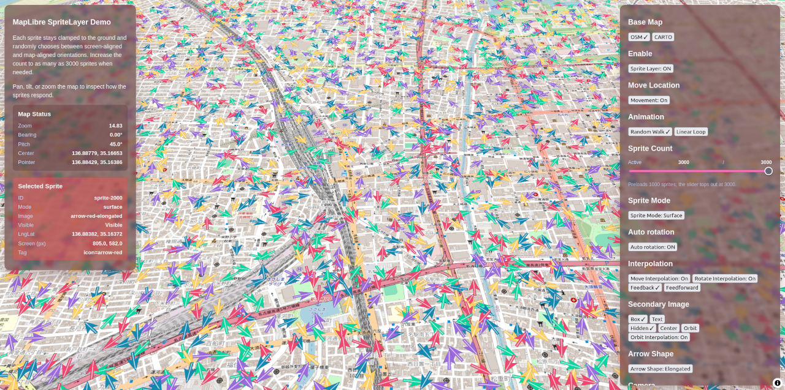
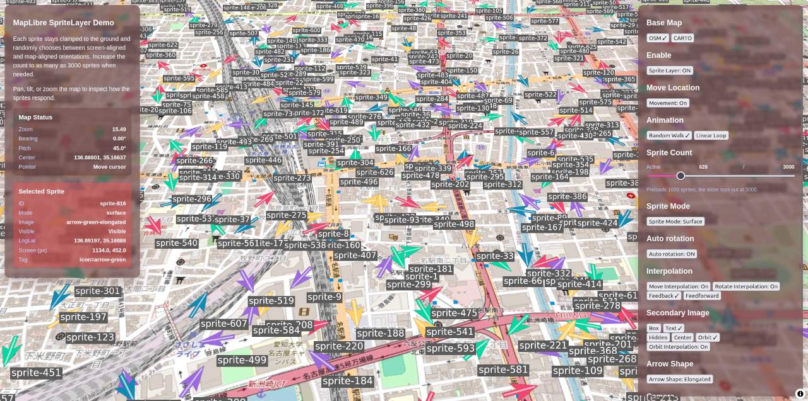
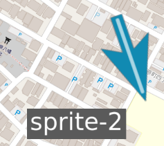
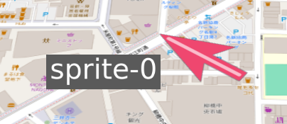
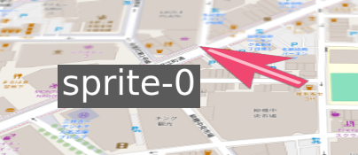
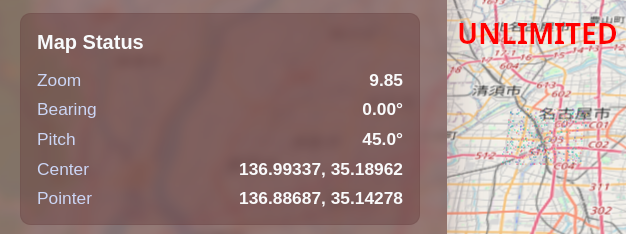
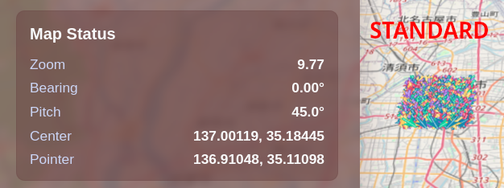

# maplibre-gl-layers

MapLibre's layer extension library enabling the display, movement, and modification of large numbers of dynamic sprite images


[](https://www.repostatus.org/#wip)
[](https://opensource.org/licenses/MIT)
[](https://www.npmjs.com/package/maplibre-gl-layers)

---

[(Japanese language is here/日本語はこちら)](./README_ja.md)

## What is this?

With [MapLibre GL JS](https://maplibre.org/maplibre-gl-js/docs/), you can place markers on a map, decorate their appearance, and move them freely.
Markers often need to move smoothly, appear and disappear over time, and you may have countless coordinates to render.

**maplibre-gl-layers** is designed to meet that need.

Using this package, you can place and adjust large collections of sprites (marker images) through a straightforward API ([This demo page is here](https://kekyo.github.io/maplibre-gl-layers/)):



Here is a minimal example that adds a single sprite:

```typescript
// Use MapLibre GL JS together with maplibre-gl-layers
import { Map } from 'maplibre-gl';
import {
  createSpriteLayer,
  initializeRuntimeHost,
} from 'maplibre-gl-layers';

// Create the MapLibre instance
const map = new Map({
  container: 'map',
  style: 'https://demotiles.maplibre.org/style.json',
  center: [136.885202573, 35.170006912],
  zoom: 13,
});

// Create the SpriteLayer
const spriteLayer = createSpriteLayer({ id: 'vehicles' });

// Add the layer after the map finishes loading
map.on('load', async () => {
  // Initialize and add SpriteLayer to MapLibre
  await initializeRuntimeHost();
  map.addLayer(spriteLayer);

  // Register an image that can be referenced by sprites
  const MARKER_IMAGE_ID = 'marker';
  await spriteLayer.registerImage(MARKER_IMAGE_ID, '/assets/marker.png');

  // Place a sprite that uses the registered image
  const SPRITE_ID = 'vehicle-1';
  spriteLayer.addSprite(SPRITE_ID, {
    // Specific location
    location: { lng: 136.8852, lat: 35.17 },
    images: [
      {
        subLayer: 0,
        order: 0,
        imageId: MARKER_IMAGE_ID, // The image ID
      },
    ],
  });

  // ...continue manipulating sprites through the SpriteLayer API
});
```

You can place, update, and remove sprites or the images assigned to them at any time through the API.

In addition to images, you can render text alongside sprites and animate them together. That makes it easy to build the kinds of visualizations typically required for assets, vehicles, or other moving features:



### Main Features

- Place, update, and remove large numbers of sprites.
- Move each sprite's coordinate freely, making it easy to represent moving objects.
- Specify per-sprite anchor positions for precise rendering.
- Add multiple images and text to the same sprite, adjusting rotation, offset, scale, opacity, and more.
- Animate sprite movement, rotation, and offsets with interpolation controls.
- Control draw order via sub-layers and per-sprite ordering.

### Requirements

- MapLibre GL JS 5.9 or higher

---

## Installation

The library is published as an npm package. Install it in your project with:

```bash
npm install maplibre-gl-layers
```

## Initialization

First create a `SpriteLayer` instance and add it to the MapLibre map.

```typescript
// Use MapLibre GL JS
import { Map } from 'maplibre-gl';
import {
  createSpriteLayer,
  initializeRuntimeHost,
} from 'maplibre-gl-layers';

// Create the MapLibre map with your desired style and initial view
const map = new Map({
  container: 'map',
  style: 'https://demotiles.maplibre.org/style.json',
  center: [136.885202573, 35.170006912],
  zoom: 13,
});

// Create the SpriteLayer instance
const spriteLayer = createSpriteLayer({ id: 'vehicles' });

// When MapLibre is ready
map.on('load', async () => {
  // Initialize SpriteLayer
  await initializeRuntimeHost();

  // Add the layer once
  map.addLayer(spriteLayer);

  // ...
});
```

That is all you need for the initial setup. After this, prepare the images and text you want to render and start displaying sprites.

## Registering Images and Text

Images must be registered with the SpriteLayer before they can be drawn. You can register or unregister them at any time; when you have many different images, register each one only when it is needed.

```typescript
// Register the specified image file
// with a SpriteLayer for display purposes
const ARROW_IMAGE_ID = 'arrow';
await spriteLayer.registerImage(
  ARROW_IMAGE_ID, // Image ID
  '/assets/arrow.png' // URL
);
```

You can also register arbitrary text. Internally, images and text glyphs are both managed as textures, so text shares the same ID space.

```typescript
// Registers the specified text as a SpriteLayer
const TEXT_LABEL1_ID = 'text-label-1';
await spriteLayer.registerTextGlyph(
  TEXT_LABEL1_ID, // Text ID (Same as image ID)
  'The Station', // The text string
  { maxWidthPixel: 128 }, // Maximum width in pixel
  {
    color: '#ffffff', // Apply text attributes
    backgroundColor: 'rgba(0, 0, 0, 0.6)',
    paddingPixel: { top: 6, right: 10, bottom: 6, left: 10 },
  }
);
```

When you register an image, its intrinsic size is used automatically. Text requires explicit sizing information. Dimensions are specified in pixels but are ultimately converted to map scale through the SpriteLayer options. By default, 1 px corresponds to 1 meter.

The figure below compares the rendered sizes of an arrow and a text label, helping you balance them visually:



(Be aware that the actual on-screen size may not exactly match the declared size. Surface and billboard modes, introduced below, can make the results appear different.)

There are two ways to size a text glyph:

- `maxWidthPixel`: The glyph scales to fit within the specified width. When the text contains line breaks, the longest line is used to calculate the font size.
- `lineHeightPixel`: The height of a single line is fixed. When line breaks are present, the total height becomes `lineHeightPixel × number_of_lines`.

In most situations, specifying `maxWidthPixel` is sufficient.

## Sprites and Rendering Modes

A sprite consists of:

- A base coordinate that acts as the origin.
- One or more images, each with its own offset and rendering attributes.

The following illustration shows a single sprite that renders two images. One is a red arrow centered on the sprite coordinate, the other is a text label offset to the left:



The arrow appears slightly flattened because the map is pitched at 45 degrees. The arrow behaves as though it is attached to the map surface. This is called **surface mode**. The text label, however, looks different.

When the pitch increases to 60 degrees, the arrow is flattened even more, yet the text stays perfectly upright, facing the camera:



The label always faces the camera regardless of pitch. This is called **billboard mode**.

Each image can choose its own mode. In the example above the arrow uses surface mode and the label uses billboard mode, but you can pick whatever makes sense for each image. Billboard mode is useful for icons or HUD-style overlays that must remain legible, while surface mode is ideal for elements that should follow the map surface.

The following code places a sprite similar to the example:

```typescript
// Place the sprite
const SPRITE_ID = 'vehicle-1';
spriteLayer.addSprite(SPRITE_ID, {
  // Sprite location (base location point)
  location: { lng: 136.8852, lat: 35.17 },
  // Sprite images
  images: [
    {
      subLayer: 0, // Render farther back
      order: 0,
      imageId: ARROW_IMAGE_ID, // Arrow image ID
    },
    {
      subLayer: 1, // Render in front
      order: 0,
      imageId: TEXT_LABEL1_ID, // Text label ID
    },
  ],
});
```

## Sub-layers and Order

Each image must specify both a sub-layer (`subLayer`) and an order (`order`). If you do not care about draw order, you can simply set both to `0`.

Sub-layers, orders, and camera-facing depth work together as follows:

1. **Sub-layer** - Works like separate MapLibre layers. Images assigned to different sub-layers never overlap with one another; higher sub-layer IDs render in front regardless of camera depth. This is useful for HUD-style overlays such as labels versus markers.
2. **Order** - Within the same sub-layer, higher order values render in front. Use this to stack multiple images at the same location, for example to combine a decorated background and text.
3. **Camera depth** - When both sub-layer and order are equal, camera-facing depth decides which image appears in front. Sprites are still 2D quads, so the result may not always match real-world expectations when many images overlap.

The following image shows an example where multiple arrows and labels overlap:


Since the arrows and text labels are placed on different sublayers, the text labels are always drawn in front of the arrows, regardless of depth. Furthermore, since arrows and text labels are placed on the same sublayer, their order is determined based on the depth relative to the camera's front:

## Anchors

The `anchor` option controls which point inside the image aligns with the sprite’s base coordinate. Both `anchor.x` and `anchor.y` are normalized between -1 (left or bottom) and 1 (right or top). The default `{ x: 0, y: 0 }` places the image center on the sprite location. Adjusting the anchor lets you fine-tune the placement and the pivot used for rotation. Values should generally be between -1 and 1, but values outside this range may be specified as needed.

The anchor applies in both surface and billboard modes. Other options such as `rotateDeg`, `scale`, `offset`, and `originLocation` are all calculated from the anchor position.

The following example demonstrates how setting an anchor at the arrowhead enables more precise coordinate positioning on the map. For registered images where the arrowhead is drawn pointing upward, this is achieved by specifying the anchor position at the top center:

```typescript
// Place the tip of the arrow on the sprite location
spriteLayer.addSprite('vehicle-anchor', {
  location: { lng: 136.8852, lat: 35.17 },
  images: [
    {
      subLayer: 0,
      order: 0,
      imageId: ARROW_IMAGE_ID, // Arrow (Pointing upward)
      anchor: { x: 0, y: 1 }, // Use the top-center as the anchor
    },
  ],
});
```

## Offset

The `offset` option displaces an image from its anchor. `offset.offsetMeters` specifies the distance in meters, and `offset.offsetDeg` specifies the heading. Surface mode interprets the heading as clockwise degrees from geographic north, while billboard mode uses clockwise degrees from the top of the screen.

Distances are converted to pixels according to the SpriteLayer scaling options, so zooming or pitching the map keeps the relative placement intact. Without an offset, the image renders directly at the anchor.

```typescript
// Place a billboard label 12 meters to the right of the sprite
spriteLayer.addSprite('vehicle-label', {
  location: { lng: 136.8852, lat: 35.17 },
  images: [
    {
      subLayer: 1,
      order: 0,
      imageId: TEXT_LABEL1_ID, // Text ID (Image ID)
      mode: 'billboard',
      offset: { offsetMeters: 12, offsetDeg: 90 }, // Shift right to 12 meter
    },
  ],
});
```

## Image Rotation

`rotateDeg` rotates an image around its anchor. Surface mode interprets angles as clockwise degrees from geographic north; billboard mode uses clockwise degrees from the top of the screen. Because the anchor is used as the pivot, you can rotate objects such as pins around their tips.

The following example sets an anchor at the tip of an upward-pointing arrow image, rotates the image 180 degrees, and makes it a downward-pointing arrow with the arrow tip as the anchor:

```typescript
// Keep the arrow anchored at its tip while rotating it downward
spriteLayer.addSprite('vehicle-rotated', {
  location: { lng: 136.8852, lat: 35.17 },
  images: [
    {
      subLayer: 0,
      order: 0,
      imageId: ARROW_IMAGE_ID, // The image pointing upward
      anchor: { x: 0, y: 1 }, // Anchor at the up-center (arrow tip)
      rotateDeg: 180, // Rotate 180 degrees so the arrow points downward
    },
  ],
});
```

## Image Scale

`scale` multiplies the width and height of the image and also affects `offset.offsetMeters`.

First, the `scale` and zoom factor are multiplied by the original image size. Based on this result, the anchor position and rotation center are determined. Furthermore, the offset distance is also scaled by the `scale`, ensuring the overall relative balance of the sprite is maintained.

The calculation is common to both billboard and surface modes, yielding results similar to changing the actual scale on the map (`metersPerPixel`) for each image. While this appears natural in surface mode, it may differ from the intended sense of scale in billboard mode.

The following are examples of applying scale to each image:

```typescript
// Shrink the marker and label while keeping their relative spacing
spriteLayer.addSprite('vehicle-scaled', {
  location: { lng: 136.8852, lat: 35.17 },
  images: [
    {
      subLayer: 0,
      order: 0,
      imageId: ARROW_IMAGE_ID,
      scale: 0.5,  // Scale to reduce to half size
      anchor: { x: 0, y: -1 },
    },
    {
      subLayer: 1,
      order: 0,
      imageId: TEXT_LABEL1_ID,
      mode: 'billboard',
      scale: 0.5,  // Scale to reduce to half size
      originLocation: { subLayer: 0, order: 0, useResolvedAnchor: true },
      offset: { offsetMeters: 10, offsetDeg: 0 },
    },
  ],
});
```

Note: `rotateDeg` and `offset` are interpreted after applying `scale` to the image's actual size and reflecting anchor-based reference point movement. That is:

1. Scale the image to enlarge or reduce it
2. Determine the reference coordinate point from the anchor position
3. Add the offset distance and direction
4. Rotate the image

Calculations proceed in the above order.

When the anchor is set outside the center, rotation and offset are always applied relative to the anchor. If the position feels unintended, review the combination of anchor, rotation, and offset. Note that in Billboard mode, the offset angle is relative to the screen, while in Surface mode it is relative to geographic coordinates using magnetic north as the reference.

## Auto Heading Rotation

Enable `autoRotation` to rotate images automatically according to their movement.

In Surface Mode, this is set to `true` by default, calculating the reference angle based on the latest movement vector. It can also be enabled in Billboard Mode, where the angle itself is calculated. However, since the camera always faces forward and the upward direction does not align with magnetic north, the rendering may appear counterintuitive.

Specifying the minimum movement distance required for angle calculation with `autoRotationMinDistanceMeters` suppresses noise caused by minor vibrations. Since `rotateDeg` is added to the angle obtained by auto-rotation (it is not overwritten), it can also be used in combination when further correction from the reference direction is desired.

```typescript
// Rotate according to movement, updating only after the sprite moves 5 meters
spriteLayer.addSprite('vehicle-auto', {
  location: { lng: 136.8852, lat: 35.17 },
  images: [
    {
      subLayer: 0,
      order: 0,
      imageId: ARROW_IMAGE_ID,
      mode: 'surface',
      autoRotation: true, // Enabled auto rotation
      autoRotationMinDistanceMeters: 5, // Calculate after moving 5 meters
    },
  ],
});
```

## Sprite Movement Interpolation

SpriteLayer can interpolate sprite positions to produce smooth animations. Consider:

- **Start and end locations** - Interpolation travels between these two points automatically.
- **Duration** - The amount of time spent moving from start to end.
- **Mode** - Either feedback or feed-forward.

By default, when you update a sprite’s location it jumps immediately. Supplying interpolation options animates the movement instead.

```typescript
// Place the sprite by specifying its initial coordinates
const SPRITE_ID = 'vehicle-interpolation';
spriteLayer.addSprite(SPRITE_ID, {
  location: { lng: 136.8852, lat: 35.17 },
  images: [
    { subLayer: 0, order: 0, imageId: ARROW_IMAGE_ID, autoRotation: true },
  ],
});

// Travel to the next point in 800 ms,
// using feed-forward to anticipate heading
spriteLayer.updateSprite(SPRITE_ID, {
  location: { lng: 136.8875, lat: 35.165 },
  interpolation: { durationMs: 800, mode: 'feedforward' },
});
```

How the old and new coordinates are used for interpolation calculations depends on the interpolation method:

- **Feedback**: Moves from the old coordinates to the new coordinates over the specified interpolation time.
- **Feedforward**: Assumes movement from the old coordinates to the new coordinates over the specified interpolation time. Extends this vector by the interpolation time to obtain the predicted movement coordinates. Then moves from the new coordinates to the predicted movement coordinates over the specified interpolation time.

With feedback, even if a new coordinate is set, the animation won't reach that coordinate until it finishes, so there will always be a display delay. On the other hand, using feedforward allows reaching near the predicted movement coordinate, so the supplied coordinate and the displayed coordinate can be expected to match quite closely.

Of course, since this is a predicted coordinate, a disadvantage is that if the movement direction or speed changes significantly during the move, it will continue moving toward an incorrect coordinate. Nevertheless, when a new coordinate is supplied, it will be corrected to move quickly toward that new coordinate, so the coordinate deviation should converge.

## Interpolating Rotation and Offsets

Similar to sprite movement interpolation, you can also interpolate image rotation and the offset parameters. While these functions are similar, they are distinct from sprite position interpolation.

Use the per-image `interpolation` property to smooth changes to `rotateDeg`, `offset.offsetDeg`, and `offset.offsetMeters`. Each channel accepts its own `durationMs`, optional easing function, and interpolation mode. While interpolation is active, the values update every frame until the specified duration completes; passing `null` disables interpolation for that channel.

Below are examples of applying interpolation for the image rotation angle and both offset parameters:

```typescript
// Smoothly rotate the image to 180 degrees over 400 ms
spriteLayer.updateSpriteImage('vehicle-rotated', 0, 0, {
  rotateDeg: 180, // Rotate toward 180 degrees
  interpolation: {
    rotateDeg: { durationMs: 400 },
  },
});

// Smoothly change the offset heading over 600 ms
spriteLayer.updateSpriteImage('vehicle-label', 1, 0, {
  offset: {
    offsetMeters: 12,
    offsetDeg: 45 // Rotate toward 180 degrees
  },
  interpolation: {
    offsetDeg: { durationMs: 600 },
    offsetMeters: { durationMs: 600 },
  },
});

// To stop interpolation, set the relevant parameter to `null`
spriteLayer.updateSpriteImage('vehicle-label', 1, 0, {
  interpolation: {
    offsetDeg: null,
    offsetMeters: null,
  },
});
```

## Referencing Base Positions and Anchors

By default, each image uses the sprite’s (optionally interpolated) `location` as its base. You can reuse another image’s base by specifying `originLocation`. This lets you treat several images as a single grouped element.

References are resolved recursively. When `useResolvedAnchor` is `true`, the referenced image’s anchor, offset, and rotation are applied before the position is reused. When it is `false` or omitted, the raw position prior to applying the anchor is used.

```typescript
// Keep the label anchored above the arrow, even when the arrow moves or rotates
spriteLayer.addSprite('vehicle-group', {
  location: { lng: 136.8852, lat: 35.17 },
  images: [
    {
      subLayer: 0,
      order: 0,
      imageId: ARROW_IMAGE_ID,
      anchor: { x: 0, y: -1 },
    },
    {
      subLayer: 1,
      order: 0,
      imageId: TEXT_LABEL1_ID,
      mode: 'billboard',
      originLocation: { subLayer: 0, order: 0, useResolvedAnchor: true },
      offset: { offsetMeters: 8, offsetDeg: 0 },
    },
  ],
});
```

Keep in mind:

- The referenced image must belong to the same sprite.
- Circular references or references to missing images produce errors, so design chains carefully.

## Event Handlers

SpriteLayer exposes interaction events so your application can react to clicks and hovers:

- `spriteclick` fires when the user clicks or taps on an image.
- `spritehover` fires whenever the pointer moves over an image.

If either event fails to detect the target image, it will notify with `sprite`/`image` set to `undefined`.

Inside either handler you can call `updateSprite` or other APIs to react to user interaction.

```typescript
// When a MapLibre map is clicked or tapped
spriteLayer.on('spriteclick', ({ sprite }) => {
  // A sprite image is present at the clicked position
  if (sprite) {
    const { spriteId } = sprite;
    // Calculating the next coordinates based on the click position
    // and moving them over 500ms
    const nextLocation = {
      lng: sprite.currentLocation.lng + 0.002,
      lat: sprite.currentLocation.lat,
    };
    spriteLayer.updateSprite(spriteId, {
      location: nextLocation,
      interpolation: { durationMs: 500, mode: 'feedback' },
    });
  }
});
```

You can also surface hover highlights or tooltips:

```typescript
// When hovering over the MapLibre map
spriteLayer.on('spritehover', ({ sprite, image }) => {
  // Sprite image not detected
  if (!sprite || !image) {
    hideTooltip();
    return;
  }
  // Display sprite and image information
  showTooltip({
    spriteId: sprite.spriteId,
    imageId: image.imageId,
    mode: image.mode,
  });
});
```

Note: Hooking event handlers incurs additional overhead for coordinate detection.
This may impact performance, especially when frequently updating sprite coordinates.

## Tags

Each sprite can store arbitrary metadata through the `tag` property.

You assign the tag when calling `addSprite` or `updateSprite`, then read it later from `sprite.tag`. Tags do not affect rendering directly; instead they let your application identify vehicle types, ownership, backend IDs, or drive custom behaviors when a sprite is interacted with.

Because the tag type is generic, you can provide an explicit type parameter when creating the SpriteLayer so that your code remains type-safe in TypeScript. Updating a tag does not trigger a redraw unless other visual properties change.

```typescript
// User defined tag type
type VehicleTag = {
  id: string;
  type: 'bus' | 'train' | 'delivery';
};

// Create the SpriteLayer with a strongly typed tag
const spriteLayer = createSpriteLayer<VehicleTag>({ id: 'vehicles' });

// Create the sprite with a tag
spriteLayer.addSprite('vehicle-101', {
  location: { lng: 136.8852, lat: 35.17 },
  tag: { id: 'veh-101', type: 'bus' },  // Tag
  images: [
    { subLayer: 0, order: 0, imageId: ARROW_IMAGE_ID, autoRotation: true },
  ],
});

// Branch behavior based on the tag when the sprite is clicked
spriteLayer.on('spriteclick', ({ sprite }) => {
  if (sprite.tag?.type === 'train') {
    openTrainDetail(sprite.tag.id);
  } else if (sprite.tag) {
    openVehicleSummary(sprite.tag.id);
  }
});
```

To change or remove a tag later, call `updateSprite` with a new `tag` value. Passing `null` (or omitting the property) clears the tag.

## Bulk Sprite Management

SpriteLayer now offers bulk functions makes faster where many sprites must be placed or removed at once.

- `addSprites` accepts either a record (`Record<string, SpriteInit<TTag>>`) or an array of [`SpriteInitEntry<TTag>`](./maplibre-gl-layers/src/types.ts) objects. The latter simply extends `SpriteInit` with a `spriteId` field for convenience. The method returns how many sprites were inserted.
- `removeSprites` removes multiple sprites by ID and returns the number of entries that were present.
- `removeAllSprites` clears every sprite and reports how many were removed.
- `removeAllSpriteImages(spriteId)` removes every image assignment from the specified sprite while leaving the sprite shell intact, returning the number of images that were removed.

The following are examples:

```typescript
// Array form using SpriteInitEntry
const vehicles: SpriteInitEntry<VehicleTag>[] = [
  {
    spriteId: 'vehicle-201',
    location: { lng: 136.881, lat: 35.169 },
    images: [{ subLayer: 0, order: 0, imageId: ARROW_IMAGE_ID }],
    tag: { id: 'veh-201', type: 'bus' },
  },
  {
    spriteId: 'vehicle-202',
    location: { lng: 136.883, lat: 35.172 },
    images: [{ subLayer: 0, order: 0, imageId: ARROW_IMAGE_ID }],
    tag: { id: 'veh-202', type: 'delivery' },
  },
];

// Bulk place helpers
const added = spriteLayer.addSprites(vehicles);
console.log(`Sprites added: ${added}`);

// Record form
const moreVehicles = {
  'vehicle-301': {
    location: { lng: 136.89, lat: 35.173 },
    images: [{ subLayer: 0, order: 0, imageId: ARROW_IMAGE_ID }],
  },
  'vehicle-302': {
    location: { lng: 136.887, lat: 35.168 },
    images: [{ subLayer: 0, order: 0, imageId: ARROW_IMAGE_ID }],
  },
} satisfies Record<string, SpriteInit<VehicleTag>>;
spriteLayer.addSprites(moreVehicles);

// Bulk removal helpers
const removed = spriteLayer.removeSprites(['vehicle-201', 'vehicle-302']);
console.log(`Sprites removed: ${removed}`);

// Full resets
spriteLayer.removeAllSpriteImages('vehicle-202'); // Removes all images from a single sprite
spriteLayer.removeAllSprites(); // Removes every sprite
```

When you need to update many sprites at once, SpriteLayer provides two helpers that report how many sprites changed:

- `mutateSprites` synchronises a known set of sprite IDs in one pass. It works well when you have a batch of server-side updates or a diff-like structure.
- `updateForEach` iterates over every registered sprite so you can adjust them based on client-side context. Returning `false` from the callback stops the iteration early.

The snippet below demonstrates `mutateSprites` in conjunction with server data that may create, update, or remove sprites:

```typescript
import type { SpriteLocation, SpriteMutateSourceItem } from 'maplibre-gl-layers';

// Differential data structure
interface VehicleUpdate extends SpriteMutateSourceItem {
  spriteId: string;  // Need spriteId field
  location: SpriteLocation;
  tag?: VehicleTag | null;
  remove?: boolean;
};

// Receives differential data
const serverUpdates: VehicleUpdate[] = await fetchVehicleUpdates();

// Bulk mutation
const changed = spriteLayer.mutateSprites(serverUpdates, {
  // For adding (when does not exist the sprite id)
  add: (update) => ({
    location: update.location,
    images: [{ subLayer: 0, order: 0, imageId: ARROW_IMAGE_ID }],
    tag: update.tag ?? null,
  }),
  // For modifying
  modify: (update, sprite, updater) => {
    // Remove when raised a flag
    if (update.remove) {
      return 'remove';
    }

    // Updates attributes
    updater.location = update.location;
    updater.interpolation = { durationMs: 600, mode: 'feedforward' };
    updater.tag = update.tag ?? null;
    return 'notremove';
  },
});
console.log(`Sprites changed: ${changed}`);
```

If you only need to mutate existing sprites based on local state, keep using `updateForEach`:

```typescript
// Dim only sprites tagged as buses by lowering their opacity
const dimmed = spriteLayer.updateForEach((sprite, updater) => {
  if (sprite.tag?.type !== 'bus') {
    return true; // Skip sprites that are not buses
  }

  // Adjust the transparency of images in sub-layer 0/order 0
  updater.updateImage(0, 0, { opacity: 0.6 });
  return true; // Continue iterating
});
console.log(`Sprites with adjusted opacity: ${dimmed}`);
```

The updater passed to `updateForEach` is reusable. Avoid storing it outside the callback; apply changes immediately. To inspect the current image layout, call `updater.getImageIndexMap()` and iterate through the available sub-layer and order pairs.

---

## Initialize Options

`createSpriteLayer(options?: SpriteLayerOptions)` accepts a small set of configuration values that govern how sprites are identified and scaled on the map.

```typescript
// Create a SpriteLayer with specified initialization options
const spriteLayer = createSpriteLayer({
  id: 'vehicles',
  spriteScaling: {  // Apply scaling options
    zoomMin: 8,
    zoomMax: 20,
    scaleMin: 0.1,
    scaleMax: 1,
    spriteMinPixel: 24,
    spriteMaxPixel: 100,
    metersPerPixel: 1,
  },
  textureFiltering: {  // Apply texture quality options
    minFilter: 'linear-mipmap-linear',
    generateMipmaps: true,
    maxAnisotropy: 4,
  },
  showDebugBounds: false, // Draw red hit-test outlines while debugging
});
```

- `id` - Optional MapLibre layer identifier. If omitted the layer registers itself as `sprite-layer`.
- `spriteScaling.zoomMin` / `zoomMax` - Zoom bounds that drive interpolation between `scaleMin` and `scaleMax`.
  When the current map zoom is below `zoomMin`, sprites use `scaleMin`; when above `zoomMax`, they use `scaleMax`; anything in between is linearly interpolated.
  Supplying reversed values is allowed—`resolveScalingOptions` swaps them internally and reports the correction through `console.warn`.
- `spriteScaling.scaleMin` / `scaleMax` - Scale multipliers applied at `zoomMin` and `zoomMax`.
  Values lower than zero are clamped to zero before interpolation.
- `spriteScaling.spriteMinPixel` / `spriteMaxPixel` - Lower and upper clamps for the rendered size of each sprite (evaluated against the longest side in pixels).
  Setting either value to `0` disables that clamp.
  The clamping logic applies to both billboard and surface imagery so icons remain legible without blowing up at extreme zoom levels.
- `spriteScaling.metersPerPixel` - Baseline conversion between texture pixels and world meters when zoom-dependent scaling is 1.0.
  Larger values make every sprite appear bigger at the same zoom level.
  The resolver clamps non-positive values back to the default (1 meter per pixel) and logs a warning.
  We strongly recommend specifying the default value of 1, as this value affects all calculations.
  To adjust the size of sprite images, you can use the `scale` property specified for each image.
- `textureFiltering.minFilter` / `magFilter` - Override the WebGL texture filters used when sprites shrink or expand. The defaults match `linear` filtering in both directions. Setting `minFilter` to a mipmap variant (for example `linear-mipmap-linear`) automatically enables mipmap generation for newly registered images.
- `textureFiltering.generateMipmaps` - Forces mipmap generation even when the chosen filter does not require it, improving quality for aggressively downscaled sprites on WebGL2 or power-of-two images. When the context cannot build mipmaps (for example WebGL1 with non power-of-two textures) the layer falls back to linear filtering automatically.
- `textureFiltering.maxAnisotropy` - Requests anisotropic filtering (>= 1) when the runtime exposes `EXT_texture_filter_anisotropic`, helping surface-aligned sprites remain sharp at shallow viewing angles. The requested value is clamped to the GPU limit and only applied when mipmaps are available.
- `showDebugBounds` - When `true`, the layer overlays red outlines representing sprite hit-test regions.
  This is intended for debugging pointer interaction event handler and should remain `false` in production for best performance.

All scaling values and texture filtering values are resolved once when `createSpriteLayer` is called. To change them later, remove the layer and recreate it with new options.
Invalid inputs are normalized and reported via `console.warn` to help catch configuration mistakes during development.

### Scaling Options

The motivation for fine-tuning scaling options is to improve rendering results when zooming in or out to extreme levels. The example below shows the result of zooming out without specifying scaling options. Most sprites appear extremely small, making it difficult to even discern their presence:



As a standard option for applying moderate scaling restrictions, you can use `STANDARD_SPRITE_SCALING_OPTIONS`. This option applies scaling restrictions to sprite images during zoom-in and zoom-out operations, ensuring that even when zoomed out, you can still discern what exists there:



```typescript
// Create using standard scaling options
const spriteLayer = createSpriteLayer({
  id: 'vehicles',
  spriteScaling: STANDARD_SPRITE_SCALING_OPTIONS,
});
```

The [demo page](https://kekyo.github.io/maplibre-gl-layers/) features a button to switch between `Standard` and `Unlimited`. You may want to check what happens when you zoom in and out.

Note: The default scaling option is set to “Unlimited” because introducing restrictions causes loss of precise size rendering. We strongly recommend disabling the scaling option, especially when experimenting with image and text placement.

---

## Enabling WASM acceleration

By default, SpriteLayer performs coordinate calculations using its JavaScript implementation.
Initializing the WASM runtime module offloads coordinate calculations to the WASM module.

You can attempt to load the WASM host by calling `initializeRuntimeHost()` once, specifying options in the form of `{ variant?, wasmBaseUrl? }` as arguments.
If you do not call it or if initialization fails, it will automatically fall back to JavaScript calculations.

```typescript
// Execute initialization to obtain the selected calculation type
const selectedVariant = await initializeRuntimeHost({
  variant: 'simd',
  wasmBaseUrl: '/custom-assets/maplibre-wasm/',
});
```

The `variant` parameter specifies the type of WASM module.

* `simd` uses SIMD operations.
* `nosimd` does not use SIMD operations.
* `simd-mt` uses multithreading and SIMD operations (with limitations; see below).

The default is `simd`. Since most modern browsers support SIMD operations, the default setting should be fine.

By specifying `wasmBaseUrl`, you can copy the `dist/wasm` directory included in the npm package to any location (such as a CDN) for operation.
If omitted, `*.wasm` files located directly under the distributed `dist` directory will be loaded as-is,
requiring no special configuration in Vite/Rollup/webpack, etc.
However, the server must include the `Content-Type: application/wasm` header.
Note that depending on the browser implementation, if the correct MIME type is not applied, the module may not load as a WASM module.

The return value indicates the selected calculation type.
For example, if loading a SIMD calculation module fails, a different type is returned.

To release WASM when the SPA page terminates, call `releaseRuntimeHost()`.
After release, it will operate using JavaScript computation until `initializeRuntimeHost()` is called again.

#### Cross-origin isolation requirements (WASM multi-threading)

By specifying `simd-mt` for the `variant`, you can load a multithreaded module that enables parallel processing of WASM operations using multiple threads.
However, `simd-mt` does not function simply by being specified.

The multithreading variant utilizes `SharedArrayBuffer`, so it will not be enabled unless cross-origin isolation is satisfied on the browser side.
The web server must include the following response headers:

- Top-level HTML opened directly by the user: `Cross-Origin-Opener-Policy: same-origin`
- That HTML and all Worker entries loaded from it (`dist/wasm/offloads-simd-mt.js`, `*.wasm` files, custom Worker bundles, etc.): `Cross-Origin-Embedder-Policy: require-corp` (or `credentialless` if you choose that)
- Assets from other origins are blocked by COEP, so explicitly allow them with CORS or an appropriate `Cross-Origin-Resource-Policy` response

If these conditions are not met, the `simd-mt` module will fail to load and fall back to `simd`.

Note: The [demo page](https://kekyo.github.io/maplibre-gl-layers/) is deployed on github.io, but unfortunately, github.io does not meet these requirements, so you cannot select `simd-mt` on the demo page.
If you want to try it out quickly, clone the repository and run the demo page locally with `npm install && npm run dev`.

When using `simd-mt` with a development server like Vite, COOP and COEP headers are also required.
For example, specify them in `vite.config.ts` as follows:

```typescript
// COOP, COEP headers
const COOP_COEP_HEADERS = {
  'Cross-Origin-Opener-Policy': 'same-origin',
  'Cross-Origin-Embedder-Policy': 'require-corp',
};

export default defineConfig({
  // When running the development server (vite dev)
  server: {
    headers: COOP_COEP_HEADERS,
  },
  // When running in preview
  preview: {
    headers: COOP_COEP_HEADERS,
  },
});
```

Additionally, you can dynamically determine whether multi-threaded modules are available using `detectMultiThreadedModuleAvailability()`.
Here is the overall initialization flow:

```typescript
import {
  initializeRuntimeHost,
  detectMultiThreadedModuleAvailability,
} from ‘maplibre-gl-layers’;

// Determine if multi-threaded modules are available
const { available, reason } = detectMultiThreadedModuleAvailability();
if (!available) {
  console.warn(
    `SIMD + Threads unavailable: ${reason ?? 'Unknown constraint'}`
  );
}

// Choose between using the multithreaded module or the regular SIMD module
const desiredVariant = available ? 'simd-mt' : 'simd';
const effectiveVariant = await initializeRuntimeHost({
  variant: desiredVariant,
});
console.log(`Actual variant used: ${effectiveVariant}`);
```

---

## TODO

- Improves performance, reduces calculation costs
- Improves minor interfaces
- Adds route-oriented layer
- Bug fixes

## License

Under MIT.
