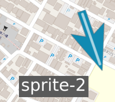
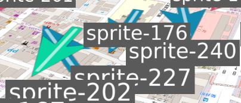

# maplibre-gl-layers

大量で動的なスプライト画像の表示・移動・変更を可能にする、MapLibreのレイヤー拡張ライブラリ


[](https://www.repostatus.org/#wip)
[](https://opensource.org/licenses/MIT)
[](https://www.npmjs.com/package/maplibre-gl-layers)

---

[(English language is here.)](./README.md)

## これは何？

[MapLibre GL JS](https://maplibre.org/maplibre-gl-js/docs/)で、地図上にマーカーを配置したり、その表示に装飾を行い、そして自由自在にマーカーを移動する。
マーカーはスムーズに移動して、時間の経過と共に増減する。
更に、マーカーを配置したい座標は沢山ある...

そんなあなたのニーズを満たすのが、**maplibre-gl-layers**ライブラリです。

このパッケージを使用すると、単純なAPIを使用して、スプライト（マーカー画像）を大量に配置して自由に調整できます ([デモページはここ](https://kekyo.github.io/maplibre-gl-layers/)):


以下は、一つのスプライトを追加する最小の例です:

```typescript
// MapLibre GL JSを使用します
import { Map } from 'maplibre-gl';
import {
  createSpriteLayer,
  initializeRuntimeHost,
} from 'maplibre-gl-layers';

// MapLibreのインスタンスを生成します
const map = new Map({
  container: 'map',
  style: 'https://demotiles.maplibre.org/style.json',
  center: [136.885202573, 35.170006912],
  zoom: 13,
});

// SpriteLayerを生成します
const spriteLayer = createSpriteLayer({ id: 'vehicles' });

// MapLibreの準備が出来たら
map.on('load', async () => {
  // SpriteLayerを初期化してMapLibreに追加します
  await initializeRuntimeHost();
  map.addLayer(spriteLayer);

  // 指定した画像ファイルを表示で使用する為に、SpriteLayerに登録します
  const MARKER_IMAGE_ID = 'marker';
  await spriteLayer.registerImage(MARKER_IMAGE_ID, '/assets/marker.png');

  // スプライトを配置し、上記で登録した画像を指定します
  const SPRITE_ID = 'vehicle-1';
  spriteLayer.addSprite(SPRITE_ID, {
    // スプライトを配置する座標
    location: { lng: 136.8852, lat: 35.17 },
    // スプライトの画像を指定
    images: [
      {
        subLayer: 0, // サブレイヤーを指定
        order: 0, // 表示優先順位を指定
        imageId: MARKER_IMAGE_ID, // 表示する画像
      },
    ],
  });

  // (... 以降、SpriteLayer APIを使用して自由にスプライトを操作可能)
});
```

スプライトの配置・変更・削除や、スプライトに割り当てた画像を追加・変更・削除など、APIを使用していつでも可能です。

画像だけでなく、テキストも同時に配置して、スプライトに連携して動かすことも出来ます。地物や移動体の可視化でおおよそ考えられる表示を簡単なAPIで実現できます:


### 主な機能

- 大量のスプライトを配置・変更・削除できる。
- 各スプライトの座標点を自由に移動出来る。つまり、移動体を簡単に表現できる。
- 各スプライトには、座標のアンカー位置を指定できる。精密な位置の描画が可能。
- 各スプライトには複数の画像を追加出来て、回転・オフセット・スケール・不透明度などを指定できる。同様にテキストも配置できる。
- スプライトの座標移動・回転・オフセットをアニメーション補間出来る。
- 画像の重なりを制御するための、サブレイヤーとオフセット指定も可能。
- 完全命令型API。高性能かつ拡張性のある更新を実現。
- WASMとシェーダーによる計算処理の高速化。

### 環境

- MapLibre GL JS 5.9 or higher

---

## インストール

ライブラリはNPMパッケージで公開されています。以下のコマンドであなたのプロジェクトにインストールして下さい:

```bash
npm install maplibre-gl-layers
```

## 初期化

最初に、SpriteLayerのインスタンスを生成して、MapLibreに追加します。

```typescript
// MapLibre GL JSを使用します
import { Map } from 'maplibre-gl';
import {
  createSpriteLayer,
  initializeRuntimeHost,
} from 'maplibre-gl-layers';

// MapLibreのインスタンスを生成します
// あなたに必要なスタイルや初期状態などを指定して下さい
const map = new Map({
  container: 'map',
  style: 'https://demotiles.maplibre.org/style.json',
  center: [136.885202573, 35.170006912],
  zoom: 13,
});

// SpriteLayerのインスタンスを生成します
const spriteLayer = createSpriteLayer({ id: 'vehicles' });

// MapLibreの準備が出来たら
map.on('load', async () => {
  // SpriteLayerを初期化
  await initializeRuntimeHost();

  // SpriteLayerをMapLibre地図に追加します
  map.addLayer(spriteLayer);

  // (...)
});
```

初期化作業はこれだけです！
この後、描画させたい画像やテキストを準備して、スプライトの表示を行います。

---

## 画像とテキストの登録

SpriteLayerで描画させたい画像は、あらかじめ登録しておく必要があります。
画像の登録や削除は任意のタイミングで行えますが、多数の異なる画像を描画する場合は、それぞれの画像を必要なタイミングで、登録したり削除したりする必要があります。

以下は、指定された画像をURLから読み取って登録し、画像IDで区別できるようにします:

```typescript
// 指定した画像ファイルを表示で使用する為に、SpriteLayerに登録します
const ARROW_IMAGE_ID = 'arrow';
await spriteLayer.registerImage(
  ARROW_IMAGE_ID,  // 画像ID
  '/assets/arrow.png'  // URL
); // 画像URL
```

また、任意のテキストを表示することも出来ますが、同様に登録と削除が必要です。画像とテキストは、内部では両方とも画像として管理されています。登録するときに指定するIDも、画像IDと同じように扱われます。

以下は、指定されたテキストを画像として登録します:

```typescript
// 指定したテキストをSpriteLayerに登録します
const TEXT_LABEL1_ID = 'text-label-1';
await spriteLayer.registerTextGlyph(
  TEXT_LABEL1_ID, // テキストのID（画像ID）
  'The Station', // 描画するテキスト
  { maxWidthPixel: 128 }, // 最大幅を指定
  {
    color: '#ffffff', // 各種テキスト属性を指定
    backgroundColor: 'rgba(0, 0, 0, 0.6)',
    paddingPixel: { top: 6, right: 10, bottom: 6, left: 10 },
  }
);
```

画像の場合は、その画像のサイズが使用されますが、テキストの場合は明示的にサイズを指定する必要があります。テキストのサイズの単位はピクセル(px)ですが、実際にはSpriteLayerのオプション指定によって比率が決定されます。既定では1pxが1メートルとして扱われます。

これにより、矢印とテキストラベルで同じようにサイズが比較できるので、以下のような描画を見てサイズのバランスを調整するのに役立ちます:



(但し、実際に描画されるサイズが指定された通りになるとは限らない事に注意して下さい。特に後述のサーフェイスモードとビルボードモードでは見た目の印象に差が発生することがあります)

テキストのサイズを指定する方法は2通りあります:

- 最大幅を指定(`maxWidthPixel`): 必ずその幅で描画される。改行を含む場合は、複数行の中から最大の幅を持つ行がこの幅となるように文字サイズが調整される。
- 1行の高さを指定(`lineHeightPixel`): 一行の高さがこの高さになるように描画される。改行を含む場合は、1行の高さ×行数が全高となるように文字サイズが調整される。

一般的には最大幅を指定すれば十分でしょう。

---

## スプライトと描画モード

スプライトの構造は以下の通りです:

- 一つのスプライトが基準となる座標点を示す。
- 一つのスプライトに、複数の画像が表示できる。簡単に示すと、各画像がスプライトの座標点からのオフセットを持っていて、それに従って画像が表示される。

以下の画像は、単一のスプライトが2つの画像を表示している例です。一つの画像はスプライト座標点の中心に赤い矢印、もう一つの画像はテキストのラベルで、左にオフセットしています:


矢印は斜め左上を向いていますが、同時に少し縦方向に「潰れている」ようにも見えると思います。これは、MapLibreがピッチ角を調整可能で、地図を45度「傾けて」表示しているからです。
この矢印は地図の表面に張り付いているように描画されています。これを「サーフェイスモード」と呼びます。しかし、テキストラベルは、矢印とは少し異なって見えます。

以下はピッチ角を更に寝かせ、60度とした場合です。矢印は更に縦に潰れていますが、テキストラベルは「カメラの視点に正対」したままであり、殆ど変わっていないことに注意して下さい:


テキストラベルはピッチ角をどのように変更しても、常にカメラ正対として描画されています。これを「ビルボードモード」と呼びます。

画像がどちらのモードで描画されるのかは、各画像毎に指定できます。つまり、この場合は、矢印がサーフェイスモード、テキストラベルがビルボードモードで描画されていることになります。上記の画像は例であり、それぞれの画像をあなたの希望に合わせて自由にモード変更できます。

これらの描画モードは、地図の視認性を元にどちらを使用するかを決めると良いでしょう。
一般的には、ビルボードモードはピッチ角の影響を受けないので、地物などの目標物を識別するアイコンや、ヘッドアップディスプレイ(HUD)表示に使用することで、視認性を向上させます。

以下のコード例は、上記のような矢印とテキストラベルを追加する例です:

```typescript
// スプライトを追加します
const SPRITE_ID = 'vehicle-1';
spriteLayer.addSprite(SPRITE_ID, {
  // スプライトを配置する座標（基準座標点）
  location: { lng: 136.8852, lat: 35.17 },
  // スプライトの画像を指定
  images: [
    {
      subLayer: 0, // サブレイヤー0を指定（奥側）
      order: 0, // 表示優先順位を指定
      imageId: ARROW_IMAGE_ID, // 矢印の画像のID
    },
    {
      subLayer: 1, // サブレイヤー1を指定（手前側）
      order: 0, // 表示優先順位を指定
      imageId: TEXT_LABEL1_ID, // 表示するテキストラベルのID
    },
  ],
});
```

## サブレイヤーとオーダー

各画像は「サブレイヤー(`subLayer`)」と「オーダー(`order`)」を指定します。これらの値は必須ですが、どのような優先順位で描画されるかを気にしないのであれば、両者ともに`0`を指定できます。

サブレイヤー、オーダー、そしてカメラ正対での奥行きは、以下のように考慮されます:

1. サブレイヤー: MapLibreのレイヤーのように、完全に独立したレイヤーとして機能します。
   各スプライトの画像がそれぞれ指定したサブレイヤーIDに配置され、描画が入れ替わることはありません。
   カメラ正対での「奥行き」が逆であっても、サブレイヤーIDの順（降順）で、手前に描画されます。
   これは、HUDのように、3D表現の表示にオーバーレイされる2Dアイテムような表現に対応します。前節の、矢印とテキストラベルがこの関係にあります。
2. オーダー: 同じサブレイヤー内では、オーダーIDの順(降順) で手前に描画されます。
   複数の画像を同じ位置に重ねて表示して、一つの意味のある画像に合成したかのように描画させたい場合は、オーダーIDで制御すると良いでしょう。凝った装飾のある背景とテキストを合成して表示する、などの用途が考えられます。
3. カメラ正対の奥行き: サブレイヤーとレイヤーが同一の場合は、カメラ正対での奥行きが考慮されて、手前に存在する場合は手前になるように描画されます。
   但し、画像は2D平面であるため、3Dポリゴンのように立体構造物として重なりが正しく表現されるわけではないことに注意して下さい。多数の画像が重なっている場合は、視覚的な自然さとは異なる順に描画される場合があります。

以下の画像は、多数の矢印とラベルが重なっている例です:



矢印とテキストラベルは異なるサブレイヤーに配置されているので、奥行きとは関係なく、常にテキストラベルが矢印より手前に描画されます。そして、矢印同士、テキストラベル同士は同じサブレイヤーに配置されているので、カメラ正対の奥行きに基づいて順序が決定されます:

## アンカー

各画像はスプライトの基準座標（`location`）に対して、画像内のどこを重ねるかを`anchor`で指定します。`anchor.x`と`anchor.y`は画像の左下を-1、中央を0、右上を1とする正規化値で、既定値は`{ x: 0, y: 0 }`（画像の中心）です。アンカーを変更すると、同じスプライト座標でも表示位置や回転の支点を細かく調整できます。値は-1～1を目安にしますが、必要に応じて範囲外を指定しても構いません。

アンカーはモードに関わらず機能し、後述の`rotateDeg`・`scale`・`offset`・`originLocation`もこのアンカー位置から計算されます。

以下は、矢印の先端にアンカーを設定することで、より地図上での精密な座標位置を表現させる例です。登録済みの画像は、矢印の先端が上向きに描かれてい場合に、アンカー位置を上端中央に指定することでこれを実現します:

```typescript
// 矢印の先端を基準座標に合わせるアンカー設定例
spriteLayer.addSprite('vehicle-anchor', {
  location: { lng: 136.8852, lat: 35.17 },
  images: [
    {
      subLayer: 0,
      order: 0,
      imageId: ARROW_IMAGE_ID, // 矢印(先端は上向き)
      anchor: { x: 0, y: 1 }, // 上端中央を0m地点に合わせる
    },
  ],
});
```

## オフセット

`offset`ではアンカーから一定距離だけ画像を離して配置できます。`offset.offsetMeters.current`はメートル単位の距離、`offset.offsetDeg.current`は方向を表し、サーフェイスモードでは地図上の真北を0度とした時計回り、ビルボードモードでは画面上方向を0度とした時計回りで解釈されます。

距離はSpriteLayerが管理する縮尺に基づいてピクセルへ換算されるため、ズームやピッチが変わっても相対位置が維持されます。設定しなければアンカー位置にそのまま描画されます。

```typescript
// スプライトの右側へ12m離した位置にビルボードラベルを配置する例
spriteLayer.addSprite('vehicle-anchor', {
  location: { lng: 136.8852, lat: 35.17 },
  images: [
    {
      subLayer: 1,
      order: 0,
      imageId: TEXT_LABEL1_ID, // テキストID(画像ID)
      mode: 'billboard',
      offset: { offsetMeters: 12, offsetDeg: 90 }, // 右に12mずらす
    },
  ],
});
```

## 画像の回転

`rotateDeg`を指定すると、アンカーを支点にして画像を回転できます。サーフェイスモードでは真北を0度とした時計回り、ビルボードモードでは画面上方向を0度とした時計回りで解釈されます。アンカーが中心以外でもその位置を軸に回転するため、ピンの先端や車両の重心を基準にしたまま向きを調整できます。

以下の例は、上向きの矢印画像の先端にアンカーを設定し画像を180度回転させて、下向きの矢印かつ矢印先端がアンカーとなるようにする例です:


```typescript
// 矢印の先端を地図上の現在地に固定したまま下向きに回転させる
spriteLayer.addSprite('vehicle-anchor', {
  location: { lng: 136.8852, lat: 35.17 },
  images: [
    {
      subLayer: 0,
      order: 0,
      imageId: ARROW_IMAGE_ID, // 画像は上向き矢印を想定
      anchor: { x: 0, y: 1 }, // 先端（上端中央）を基準座標に重ねる
      rotateDeg: 180, // アンカーを支点に180度回転して下向きにする
    },
  ],
});
```

## 画像のスケール

`scale`は画像の幅・高さを倍率で拡大縮小し、同時に`offset.offsetMeters.current`で指定した距離にも掛かります。

まず元の画像サイズに`scale`とズーム倍率が掛け合わされ、その結果を基にアンカーの位置と回転の中心が決まります。
さらに、オフセット距離も`scale`で伸縮されるため、スプライト全体の相対的なバランスが保たれます。

ビルボード・サーフェイスの両モードで計算は共通で、地図上の実寸比(`metersPerPixel`)を画像毎に変更していることに近い結果となります。
これは、サーフェイスモードでは自然に見えますが、ビルボードモードでは意図したサイズ感と異なる可能性があります。

以下は各画像にスケールを適用する例です:

```typescript
// スプライト全体を半分のサイズに縮小し、ラベルの離隔距離も揃えて縮める
spriteLayer.addSprite('vehicle-scaled', {
  location: { lng: 136.8852, lat: 35.17 },
  images: [
    {
      subLayer: 0,
      order: 0,
      imageId: ARROW_IMAGE_ID,
      scale: 0.5,  // スケールを指定して半分のサイズに縮小
      anchor: { x: 0, y: -1 },
    },
    {
      subLayer: 1,
      order: 0,
      imageId: TEXT_LABEL1_ID,
      mode: 'billboard',
      scale: 0.5,  // スケールを指定して半分のサイズに縮小
      originLocation: { subLayer: 0, order: 0, useResolvedAnchor: true },
      offset: { offsetMeters: 10, offsetDeg: 0 },
    },
  ],
});
```

注意: `rotateDeg`や`offset`は、画像の実サイズに`scale`を適用した後、アンカーによる基準点移動を反映した状態で解釈されます。つまり:

1. スケールで画像の拡大・縮小を行い
2. アンカー位置から基準座標点を確定し
3. オフセット距離と方向を加算し
4. 画像を回転する

上記の順序で計算が進行します。

アンカーを中心以外に設定している場合、回転やオフセットは常にアンカー基準で適用されるため、意図と異なる位置に感じる場合は、アンカー・回転・オフセットの組み合わせを見直して下さい。
ビルボードモードではオフセット角度が画面基準、サーフェイスモードでは地理座標の磁北基準である点にも注意が必要です。

## 不透明度

各画像には`opacity`を指定でき、0.0〜1.0の範囲でアルファに乗算されます。
値が1.0ならテクスチャ本来の不透明度、0.0なら完全に不可視です。

0以下に設定すると描画キューから除外されるため、複数画像を重ねる際は不要な画像の`opacity`を0にしてコストを抑えられます。

以下はラベルだけ半透明にする例です:

```typescript
spriteLayer.addSprite('vehicle-opacity', {
  location: { lng: 136.8852, lat: 35.17 },
  images: [
    { subLayer: 0, order: 0, imageId: ARROW_IMAGE_ID },
    {
      subLayer: 1,
      order: 0,
      imageId: TEXT_LABEL1_ID,
      mode: 'billboard',
      opacity: 0.6, // テキストのみ半透明にする
    },
  ],
});
```

## 自動方位回転

スプライトの移動方向に合わせて、自動で画像を回転させたい場合は、`autoRotation`を有効にします。

サーフェイスモードでは既定で`true`になっており、最新の移動ベクトルから方位を算出して基準角度を計算します。ビルボードモードでも有効にすることが出来、角度自体は計算されますが、常にカメラ正対で上方向が磁北に一致しないため、描画は直感に反する場合があります。

`autoRotationMinDistanceMeters`で角度計算に必要な最小移動距離を指定すると、微小な揺れによるノイズを抑えられます。自動回転で得られた角度に`rotateDeg`が加算される（更新されるわけではない）ため、基準方向からさらに補正したい場合も併用できます。

```typescript
// 自動回転を利用しつつ、最低5m移動したときだけ向きを計算する
spriteLayer.addSprite('vehicle-auto', {
  location: { lng: 136.8852, lat: 35.17 },
  images: [
    {
      subLayer: 0,
      order: 0,
      imageId: ARROW_IMAGE_ID,
      mode: 'surface',
      autoRotation: true, // 自動方位回転を有効
      autoRotationMinDistanceMeters: 5, // 5m以上移動したら計算する
    },
  ],
});
```

## スプライト移動補間

SpriteLayerには、スプライトの移動を自動的に補間して、描画をなめらかにアニメーションさせる機能があります。この機能を使用するには、以下の2つの要素を考える必要があります。

- 移動始点と終点: 補間はこの2点間を自動的に補間します。
- 補間時間: 始点から終点に向かって補間を行う時、かかる時間を示します。
- 補間の方法: フィードバックまたはフィードフォワード

通常、スプライトに新しい座標を指定した場合、画像は即座に指定した座標に移動します。しかし、移動にかかる時間・補間の方法を指定して新しい座標を与えると、これらのパラメータを使用して移動のアニメーションが行われます。

次の例は、指定したスプライトを移動するときに、移動補間を行います:

```typescript
// 初期の座標を指定してスプライトを配置
const SPRITE_ID = 'vehicle-interpolation';
spriteLayer.addSprite(SPRITE_ID, {
  location: { lng: 136.8852, lat: 35.17 },
  images: [
    { subLayer: 0, order: 0, imageId: ARROW_IMAGE_ID, autoRotation: true },
  ],
});

// 800msかけて次の地点へ移動したと見なし、
// feedforwardで未来の座標を予測して移動させる
spriteLayer.updateSprite(SPRITE_ID, {
  location: { lng: 136.8875, lat: 35.165 },
  interpolation: { durationMs: 800, mode: 'feedforward' },
});
```

古い座標と新しい座標をどのようにして補間計算に使用するかは、補間の方法によって異なります:

- フィードバック: 古い座標から新しい座標に向かって、指定された補間時間をかけて移動する。

  
- フィードフォワード: 古い座標から新しい座標に向かって、指定された補間時間をかけて移動したと仮定し、そのベクトルを補間時間だけ延長した座標を移動予測座標とし、新しい座標から移動予測座標に向かって、指定された補間時間をかけて移動する。

  

フィードバックでは、新しい座標を設定しても、アニメーションが終了するまではその座標に到達しないため、常に表示が遅れることになります。一方、フィードフォワードを使用すれば、移動予測座標付近に到達することが予想されるので、供給された座標と表示座標がかなり一致することが期待できます。

もちろん、これは予測座標なので、移動中に移動方向や速度が大きく変われば、誤った座標に移動し続けてしまうデメリットがあります。それでも、新しい座標が供給されれば、そちらの方にすばやく移動するように矯正されるので、座標のズレは収斂するでしょう。

## 画像の回転角・オフセット・不透明度の補間

スプライト移動補間と似た機能として、画像ごとの回転・オフセット・不透明度を滑らかに変化させることができます。
これらはスプライトの位置補間とは独立しており、`SpriteImageDefinitionUpdate` の `interpolation` フィールドで個別に制御します。

`interpolation` は次のチャネルをサポートします。

- `rotateDeg`: 画像の追加回転角。最短経路で補間され、完了後は最終角にスナップします。
- `offsetDeg` / `offsetMeters`: オフセットの向きと距離。角度・距離を別々の時間やイージングプリセットで制御可能です。
- `opacity`: 0.0〜1.0の値を自動的にクリップしながらフェードさせます。値が0に近づくと描画が抑制されるため、LODやハイライト演出に使えます。

各チャネルに `durationMs` と補間モード（`feedback`/`feedforward`）、任意のイージングプリセット（現在は `linear` のみ）を与えます。
イージングプリセットの指定が省略された場合は、`linear` となります。
設定を削除するか `null` を渡すとそのチャネルだけ即座に停止します。

以下に、回転・オフセット・不透明度で補間を適用する例を示します:

```typescript
// 画像の回転角を400msで補間しながら変更する
spriteLayer.updateSpriteImage('vehicle-anchor', 0, 0, {
  rotateDeg: 180, // 現在の角度から180度に向かって回転
  interpolation: {
    rotateDeg: { durationMs: 400 },
  },
});

// オフセットの向きを600msで補間しながら変更する
spriteLayer.updateSpriteImage('vehicle-anchor', 1, 0, {
  offset: {
    offsetDeg: 45, // 現在の角度から45度に向かって回転
    offsetMeters: 12,
  },
  interpolation: {
    offsetDeg: { durationMs: 600, mode: 'feedforward', },
    offsetMeters: { durationMs: 600 },
  },
});

// 補間を無効化するには `null` を指定する
spriteLayer.updateSpriteImage('vehicle-anchor', 1, 0, {
  interpolation: {
    offsetDeg: null,
    offsetMeters: null,
  },
});

// 不透明度を800msかけてフェードアウトさせる
spriteLayer.updateSpriteImage('vehicle-anchor', 1, 0, {
  opacity: 0,
  interpolation: {
    opacity: { durationMs: 800, },
  },
});
```

## 全体的な補間計算の制御

スプライト全体の補間を一時停止したい場合は `setInterpolationCalculation(false)` を呼び出します。
一時停止は即時に反映され、補間中の動作も全て完全に一時停止します。
再度 `true` に戻すと、停止していた補間を途中から滑らかに再開します。

初期状態は `true` で、継続的に補間が計算されます。

以下に例を示します:

```typescript
// 補間を一時停止する
spriteLayer.setInterpolationCalculation(false);

// (何か他の処理...)

// 補間を再開すると、停止していた補間が滑らかに続行する
spriteLayer.setInterpolationCalculation(true);
```

注意: 停止中にスプライトやスプライト画像の更新を行った場合は、内部の補間ステートはリセットされます:

```typescript
// 補間を一時停止する
spriteLayer.setInterpolationCalculation(false);

// スプライトや画像に変更を加える
spriteLayer.updateSprite('car-1', {
  location: { lng: 136.8853, lat: 35.1702 },  // 即時反映される
  interpolation: { durationMs: 1000 },
});
spriteLayer.updateSpriteImage('car-1', 0, 0, {
  rotateDeg: 45,  // 即時反映される
  offset: { offsetMeters: 12, offsetDeg: 30 },  //即時反映される
  interpolation: {
    rotateDeg: { durationMs: 800 },
    offsetDeg: { durationMs: 500 },
  },
});

// 補間を再開すると、上記の設定から補間が改めて開始される
// （以前の補間ステートはリセットされる）
spriteLayer.setInterpolationCalculation(true);
```

## 基準座標点とアンカー

各画像は既定でスプライトの`location`（補間後の座標）を基準に、アンカー・オフセット・回転を計算します。`originLocation`を指定すると、同じスプライト内の別画像を座標の基準として再利用でき、複数の画像を一つの塊として扱えます。

参照は再帰的に解決され、`useResolvedAnchor`を`true`にすると参照先画像のアンカーやオフセット、回転を適用した後の位置を基準とします。省略した場合はアンカー適用前の位置を基準にします。

```typescript
// 矢印を基準に、テキストラベルを常に矢印の上側へ配置する例
spriteLayer.addSprite('vehicle-group', {
  location: { lng: 136.8852, lat: 35.17 },
  images: [
    {
      subLayer: 0,
      order: 0,
      imageId: ARROW_IMAGE_ID,
      anchor: { x: 0, y: -1 },
    },
    {
      subLayer: 1,
      order: 0,
      imageId: TEXT_LABEL1_ID,
      mode: 'billboard',
      originLocation: { subLayer: 0, order: 0, useResolvedAnchor: true },
      offset: { offsetMeters: 8, offsetDeg: 0 }, // 画面上方向へ配置
    },
  ],
});
```

注意点を示します:

- 参照する画像は、同一のスプライト内の画像に限られます。
- 循環参照や存在しない画像を指すとエラーになるため、チェーンはループしないように構成して下さい。

## 疑似LOD

疑似LODは、カメラからスプライトまでの距離によって、描画するかどうかを決定する機能です。

これは `visibilityDistanceMeters` にカメラからスプライト（の基準座標点）までの距離を指定すると機能し、
その距離以上離れるとそのスプライトの画像群は全て非表示となります。
指定していない場合は疑似LOD機能は無効となり、`opacity`が0.0を超えていれば描画されます。

以下は疑似LODを使用する例です:

```typescript
// 1.5km以内にカメラが近づいた時だけ描画するスプライト
spriteLayer.addSprite('vehicle-lod', {
  location: { lng: 136.8852, lat: 35.17 },
  visibilityDistanceMeters: 1500, // この距離を超えると自動的に非表示
  images: [
    {
      subLayer: 0,
      order: 0,
      imageId: ARROW_IMAGE_ID,
      autoRotation: true,
    },
  ],
});

// しきい値を変更する
spriteLayer.updateSprite('vehicle-lod', {
  visibilityDistanceMeters: null, // nullで疑似LODを無効化
});
```

## ボーダー

各スプライト画像には、それぞれボーダー線を描画させることができます。
これは、そのスプライト画像の視認性を向上させたり、スプライト画像の選択状態を可視化したりする目的に使えます。
また、後述のイベントハンドラがスプライト画像を判定する基準となる領域を示します。


以下にボーダーを描画させる例を示します:

```typescript
// 基本の矢印に赤の2mボーダーを付ける
spriteLayer.addSprite('bordered-marker', {
  location: { lng: 136.8852, lat: 35.17 },
  images: [
    {
      subLayer: 0,
      order: 0,
      imageId: ARROW_IMAGE_ID,
      border: { color: '#ff0000', widthMeters: 2 },
    },
  ],
});

// 後からボーダーを外す場合（nullでクリア）
spriteLayer.updateSpriteImage(
  'bordered-marker', 0, 0, { border: null });
```

注意: ボーダーは常に全てのスプライトより手前に描画されます。
つまり、サブレイヤーが常に最大の位置に配置されているのと同じとなります。

### 引き出し線

画像に`leaderLine`を指定すると、その画像の基準座標点（アンカー適用後の位置）と`originLocation`で参照された画像の基準座標点を線で結びます。
線は`color`と`widthMeters`で見た目を指定でき、不透明度は画像自身の（補間後の）`opacity`を使用します。


以下の例では、2つの画像の間に引き出し線を引きます。

```typescript
spriteLayer.addSprite('vehicle-group', {
  location: { lng: 136.8852, lat: 35.17 },
  images: [
    // プライマリ画像
    {
      subLayer: 0,
      order: 0,
      imageId: ARROW_IMAGE_ID,
    },
    // セカンダリ画像(テキスト)
    {
      subLayer: 1,
      order: 0,
      imageId: TEXT_LABEL1_ID,
      // プライマリ画像を参照
      originLocation: { subLayer: 0, order: 0, useResolvedAnchor: true },
      // 引き出し線を引く
      leaderLine: { color: '#00aa00', widthMeters: 2 },
    },
  ],
});
```

注意: 引き出し線は、常に全てのスプライトより背面に描画されます。
つまり、サブレイヤーが常に最小の位置に配置されているのと同じとなります。

## イベントハンドラ

SpriteLayerは次のインタラクションイベントを提供しています:

- `spriteclick`: 画像をクリック／タップしたときに発火します。
- `spritehover`: ポインタが画像上を移動するたびに発火します。

どちらのイベントも、対象の画像を検出できない場合は、`sprite`/`image`が`undefined`の状態で通知されます。

イベントハンドラ内から`updateSprite`などを呼び出せば、ユーザー操作に応じた挙動を簡単に実装できます。

```typescript
// MapLibreの地図がクリック・タップされたときに呼び出される
spriteLayer.on('spriteclick', ({ sprite, screenPoint }) => {
  // クリックされた位置にスプライト画像がある
  if (sprite) {
    const { spriteId } = sprite;
    // クリック位置を基準にした次の座標を計算し、500msで移動させる
    const nextLocation = {
      lng: sprite.location.current.lng + 0.002,
      lat: sprite.location.current.lat,
    };
    spriteLayer.updateSprite(spriteId, {
      location: nextLocation,
      interpolation: { durationMs: 500, mode: 'feedback' },
    });
  }
});
```

`sprite.images` を参照すると、`image.rotateDeg.current`（および必要に応じて `from`/`to`）で回転補間の状態を `sprite.location` と同じように確認できます。

ホバーイベントを使えば、ツールチップやハイライトも実現できます。

```typescript
// MapLibreの地図上をホバーしたときに呼び出される
spriteLayer.on('spritehover', ({ sprite, image }) => {
  // スプライト画像が検出されない
  if (!sprite || !image) {
    hideTooltip();
    return;
  }
  // スプライトと画像の情報を表示
  showTooltip({
    id: sprite.spriteId,
    imageId: image.imageId,
    mode: image.mode,
  });
});
```

注意: イベントハンドラをフックすると、座標検出のための追加のコストが発生します。
これは特に、頻繁にスプライト座標を更新する場合にパフォーマンスに影響する可能性があります。

## タグ

SpriteLayerでは各スプライトに任意のタグ情報を付与できます。

タグは`addSprite`や`updateSprite`で`tag`プロパティに設定し、`sprite.tag`として参照します。描画には直接影響しませんが、移動体の種別やデータソースの識別子、クリック時に呼び出す処理を分岐させるフラグなど、アプリケーション側のメタデータを持たせたいときに便利です。

タグの型はジェネリックで定義されているため、TypeScriptではSpriteLayer生成時に型パラメータを指定すると安全に扱えます。タグを更新しても描画内容に変化が無ければ再描画は発生しません。

```typescript
// ユーザー独自の型を定義
type VehicleTag = {
  id: string;
  type: 'bus' | 'train' | 'delivery';
};

// タグの型を指定してSpriteLayerを生成
const spriteLayer = createSpriteLayer<VehicleTag>({ id: 'vehicles' });

// タグ情報を追加してスプライトを生成
spriteLayer.addSprite('vehicle-101', {
  location: { lng: 136.8852, lat: 35.17 },
  tag: { id: 'veh-101', type: 'bus' },  // タグ
  images: [
    { subLayer: 0, order: 0, imageId: ARROW_IMAGE_ID, autoRotation: true },
  ],
});

// タグを参照してクリック時の挙動を切り替える
spriteLayer.on('spriteclick', ({ sprite }) => {
  if (sprite.tag?.type === 'train') {
    openTrainDetail(sprite.tag.id);
  } else if (sprite.tag) {
    openVehicleSummary(sprite.tag.id);
  }
});
```

後からタグを書き換える場合は`updateSprite`で`tag`を渡します。`null`または未指定にするとタグを削除できます。

## 複数スプライトの配置・変更・削除

大量のスプライトをまとめて配置・削除したい場合は、`addSprites`/`removeSprites`などのバルク関数を利用すると、高速に処理できます。

- `addSprites` は `Record<string, SpriteInit<TTag>>` 形式か、`spriteId` プロパティを追加した [`SpriteInitEntry<TTag>`](./maplibre-gl-layers/src/types.ts) の配列のいずれかを受け付けます。戻り値は新しく追加されたスプライト数です。
- `removeSprites` は複数のスプライトIDをまとめて削除し、削除した画像数を返します。
- `removeAllSprites` はすべてのスプライトを削除し、その数を返します。
- `removeAllSpriteImages(spriteId)` は指定したスプライトに紐づく画像情報だけをクリアし、削除した画像数を返します。

以下に例を示します:

```typescript
// SpriteInitEntry を使った配列形式
const vehicles: SpriteInitEntry<VehicleTag>[] = [
  {
    spriteId: 'vehicle-201',
    location: { lng: 136.881, lat: 35.169 },
    images: [{ subLayer: 0, order: 0, imageId: ARROW_IMAGE_ID }],
    tag: { id: 'veh-201', type: 'bus' },
  },
  {
    spriteId: 'vehicle-202',
    location: { lng: 136.883, lat: 35.172 },
    images: [{ subLayer: 0, order: 0, imageId: ARROW_IMAGE_ID }],
    tag: { id: 'veh-202', type: 'delivery' },
  },
];

// まとめて配置
const added = spriteLayer.addSprites(vehicles);
console.log(`配置したスプライト数: ${added}`);

// Record 形式
const moreVehicles = {
  'vehicle-301': {
    location: { lng: 136.89, lat: 35.173 },
    images: [{ subLayer: 0, order: 0, imageId: ARROW_IMAGE_ID }],
  },
  'vehicle-302': {
    location: { lng: 136.887, lat: 35.168 },
    images: [{ subLayer: 0, order: 0, imageId: ARROW_IMAGE_ID }],
  },
} satisfies Record<string, SpriteInit<VehicleTag>>;
spriteLayer.addSprites(moreVehicles);

// まとめて削除
const removed = spriteLayer.removeSprites(['vehicle-201', 'vehicle-302']);
console.log(`削除したスプライト数: ${removed}`);

// 一部だけリセット
spriteLayer.removeAllSpriteImages('vehicle-202'); // 指定スプライトの画像だけを削除
spriteLayer.removeAllSprites(); // スプライトをすべて削除
```

多数のスプライトを一度に更新したい場合は、`mutateSprites` と `updateForEach` を利用すると効率良く処理できます。いずれも変更が発生したスプライト数を戻り値として返します。

- `mutateSprites`: 更新対象のスプライトIDを列挙できるときに便利です。サーバーから座標や状態の差分が届くケースで、新規作成・更新・削除をまとめて処理できます。
- `updateForEach`: 登録済みスプライトをすべて走査して、クライアント側の状況に応じて一括調整します。コールバックが `false` を返すと反復処理を中断します。

以下は `mutateSprites` を使ってサーバー差分を適用する例です:

```typescript
import type { SpriteLocation, SpriteMutateSourceItem } from 'maplibre-gl-layers';

// 差分データ
interface VehicleUpdate extends SpriteMutateSourceItem {
  spriteId: string;  // spriteIdフィールドは必須
  location: SpriteLocation;
  tag?: VehicleTag | null;
  remove?: boolean;
};

// 差分データを受信する
const serverUpdates: VehicleUpdate[] = await fetchVehicleUpdates();

// 一括更新
const changed = spriteLayer.mutateSprites(serverUpdates, {
  // 追加する（スプライトIDが見つからない場合）
  add: (update) => ({
    location: update.location,
    images: [{ subLayer: 0, order: 0, imageId: ARROW_IMAGE_ID }],
    tag: update.tag ?? null,
  }),
  // 更新する
  modify: (update, sprite, updater) => {
    // 削除フラグが立っていたら削除する
    if (update.remove) {
      return 'remove';
    }

    // 各属性を更新する
    updater.location = update.location;
    updater.interpolation = { durationMs: 600, mode: 'feedforward' };
    updater.tag = update.tag ?? null;
    return 'notremove';
  },
});
console.log(`変更されたスプライト数: ${changed}`);
```

ローカルの状態だけで既存スプライトを調整したい場合は、`updateForEach` を利用できます:

```typescript
// タグが bus のスプライトだけ透明度を下げる
const dimmed = spriteLayer.updateForEach((sprite, updater) => {
  if (sprite.tag?.type !== 'bus') {
    return true; // バス以外はスキップ
  }

  updater.updateImage(0, 0, { opacity: 0.6 });
  return true; // 継続
});
console.log(`透明度を調整したスプライト数: ${dimmed}`);
```

`updateForEach` の第2引数で受け取るアップデータは再利用されます。コールバックの外に保持せず、その場で必要な変更を記述してください。現在の画像構成を調べたい場合は、`updater.getImageIndexMap()` でサブレイヤーとオーダーの組み合わせを取得できます。

---

## 初期化オプション

`createSpriteLayer(options?: SpriteLayerOptions)` では、スプライトレイヤーの識別子とスケーリング挙動を調整するためのオプションを指定できます。

```typescript
// SpriteLayerの初期化オプションを指定して生成
const spriteLayer = createSpriteLayer({
  id: 'vehicles',
  spriteScaling: {  // スケーリングオプションの指定
    zoomMin: 8,
    zoomMax: 20,
    scaleMin: 0.1,
    scaleMax: 1,
    spriteMinPixel: 24,
    spriteMaxPixel: 100,
    metersPerPixel: 1,
  },
  textureFiltering: {  // テクスチャ品質の指定
    minFilter: 'linear-mipmap-linear',
    generateMipmaps: true,
    maxAnisotropy: 4,
  },
});
```

- `id` - MapLibre に登録するレイヤー ID。省略すると `sprite-layer` が使用されます。
- `spriteScaling.zoomMin` / `zoomMax` - ズーム範囲の下限と上限です。この範囲の内側では `scaleMin` から `scaleMax` へ線形補間、範囲外ではそれぞれの端値が適用されます。
  上下が逆になっていても自動で入れ替え、警告を一度だけ出力します。
- `spriteScaling.scaleMin` / `scaleMax` - `zoomMin` / `zoomMax` で適用されるスケール係数。
  負の値は 0 に丸められてから補間に使用されます。
- `spriteScaling.spriteMinPixel` / `spriteMaxPixel` - 描画後のスプライト（ビルボードとサーフェイス双方）の最大辺ピクセル数に対する下限・上限。
  0 を指定すると該当する制限を無効化します。視認性を保ちつつ極端な拡大を抑える目的で利用します。
- `spriteScaling.metersPerPixel` - テクスチャの 1px を地図上で何メートルとして扱うかの基準値です。
  大きい値ほど同じズームでも画像が大きく表示されます。
  0 以下や非有限値を指定した場合は 1 に戻し、`console.warn` で警告します。
  この値は全ての計算に影響を与えるため、デフォルトの1を指定することを強く推奨します。
  スプライト画像の大きさを調整する場合は、画像毎に指定する`scale`を使用することができます。
- `textureFiltering.minFilter` / `magFilter` - WebGL のテクスチャフィルタリングを上書きします。既定値はいずれも `linear` です。`minFilter` にミップマップ系 (`linear-mipmap-linear` など) を指定すると、新規登録される画像で自動的にミップマップが生成されます。
- `textureFiltering.generateMipmaps` - ミップマップ必須でないフィルターを選んだ場合でもミップマップを生成します。WebGL2 もしくは 2 のベキ乗サイズの画像で大きく縮小した際の画質を改善できます。WebGL1 かつ非 2 のベキ乗画像でミップマップが生成できない場合は、自動的に `linear` フィルターへフォールバックします。
- `textureFiltering.maxAnisotropy` - `EXT_texture_filter_anisotropic` 拡張が利用できる場合に異方性フィルタリング係数を指定します (1 以上)。地表に沿ったスプライトを浅い角度から見た際のシャープさを維持できます。指定値は GPU の上限でクランプされ、ミップマップが存在する場合のみ適用されます。

これらの値（スケーリング／テクスチャフィルタリング）はレイヤー生成時に一度解決されます。動的に変更したい場合はレイヤーを再生成してください。
無効な値を指定すると自動で補正され、開発中に気付きやすいよう `console.warn` 経由で通知されます。

### スケーリングオプション

スケーリングオプションを細かく調整する動機は、極端にズームインやズームアウトした時のレンダリング結果を改善することです。以下の例では、スケーリングオプションを指定しない場合にズームアウトした様子です。殆どのスプライトは非常に小さく、そこにスプライトが存在することすらわかりにくいです:


適度にスケーリング制限を行う標準的なオプションとして、`STANDARD_SPRITE_SCALING_OPTIONS` を使用することができます。このオプションを使用すると、ズームイン・ズームアウト時のスプライト画像のスケーリングに制限が適用され、ズームアウト時も何ががそこに存在することはわかります:


```typescript
// 標準的なスケーリングオプションを指定して生成
const spriteLayer = createSpriteLayer({
  id: 'vehicles',
  spriteScaling: STANDARD_SPRITE_SCALING_OPTIONS,
});
```

[デモページ](https://kekyo.github.io/maplibre-gl-layers/) では、`Standard`と`Unlimited`を切り替えるボタンがあります。ズームイン・ズームアウトで何が起きるのかを確かめてみると良いでしょう。

注意: デフォルトのスケーリングオプションが「無制限」であるのは、制限を導入すると、正確なサイズ描画が失われるからです。特に画像やテキストの配置を試行錯誤する場合は、スケーリングオプションを無効化することを強くおすすめします。

---

## WASMによる座標計算のオフロード

SpriteLayer は既定では JavaScript 実装で座標計算を実行します。
WASMランタイムモジュールの初期化を行うと、座標計算をWASMモジュールにオフロードします。

`initializeRuntimeHost()` を一度呼び出すことで WASM ホストのロードを試行でき、引数には `{ variant?, wasmBaseUrl? }` 形式のオプションを指定できます。
呼び出さない場合や初期化に失敗した場合は、自動的に JavaScript 計算にフォールバックします。

```typescript
// 初期化を実行して、選択された計算種別を得る
const selectedVariant = await initializeRuntimeHost({
  variant: 'simd',
  wasmBaseUrl: '/custom-assets/maplibre-wasm/',
});
```

`variant`には、WASMモジュールの種別を指定できます。

- `simd`はSIMD演算を使用します。
- `nosimd`はSIMD演算を使用しません。
- `simd-mt`はマルチスレッドかつSIMD演算を使用します（制約があります。後述）

デフォルトは`simd`です。現在のブラウザはほぼSIMD演算をサポートしているので、デフォルトのままで問題ないでしょう。

`wasmBaseUrl` を指定すると、npm パッケージに含まれる `dist/wasm` ディレクトリを任意の場所（CDN など）へコピーして運用できます。
省略した場合は、配布された `dist` ディレクトリ直下にある `*.wasm` をそのまま読み込むので、Vite/Rollup/webpack 等で特別な設定は不要です。
但し、サーバーは `Content-Type: application/wasm` ヘッダを付与する必要があります。
これはブラウザの実装によりますが、正しいMIME typeが適用されていないと、WASMモジュールとしてロードできない可能性があるため注意してください。

戻り値には、選択された計算種別が返されます。例えばSIMD計算モジュールのロードに失敗した場合は、異なる種別が返されます。

WASMモジュールで計算処理中に、不明なエラーが発生した場合（主にOOM(Out of memory)）は、JavaScript実装にフォールバックして作業を継続します。
一度この状況に陥った場合は、ページリロードが発生しない限りはWASMモジュールを再使用できません。

SPAページの終了などで WASM を解放したい場合は、`releaseRuntimeHost()` を呼び出してください。
解放後は再度 `initializeRuntimeHost()` を呼び出すまで JavaScript 計算で動作します。

#### WASMマルチスレッド時の制約

`variant`に`simd-mt`を指定することで、WASM演算をマルチスレッドで並列処理させる、マルチスレッドモジュールをロード出来ます。
但し、`simd-mt`は指定するだけでは機能しません。

> 注意: WASMマルチスレッド技術は、まだ十分に実用的では無さそうです。コード自体は問題なく動作しましたが、実行環境に大きな制約が存在します。
> 今後、ブラウザの仕様が改定されるなどして状況が改善されるかもしれませんが、プロダクションレベルでの使用は十分検討してください。

1. マルチスレッドのバリアントは [`SharedArrayBuffer`](https://developer.mozilla.org/ja/docs/Web/JavaScript/Reference/Global_Objects/SharedArrayBuffer) を利用するため、ブラウザ側でクロスオリジン隔離 (cross-origin isolated) が満たされていないと有効化されません。
   ウェブサーバーが、以下のレスポンスヘッダを付与する必要があります:
   - ユーザーが直接開くトップレベル HTML: `Cross-Origin-Opener-Policy: same-origin`
   - その HTML と、そこから読み込まれるすべての Worker エントリ（`dist/wasm/offloads-simd-mt.js` や `*.wasm`、独自の Worker バンドルなど）: `Cross-Origin-Embedder-Policy: require-corp`（もしくは `credentialless` を選択する場合はそちら）
   - 別オリジンのアセットは COEP でブロックされるため、CORS もしくは `Cross-Origin-Resource-Policy` の適切な応答で明示的に許可する
   これらの条件が満たされない場合は、`simd-mt`モジュールのロードに失敗するため、`simd`にフォールバックします。
2. 使用メモリ量と使用スレッド数は、WASMモジュールのビルド時に静的に決定する必要があり、配布パッケージに含まれるWASMモジュールは、512MB/4スレッドになっています。
   - 使用メモリ量512MBは、デモページにおいて、10000スプライトをセカンダリイメージとともに表示する場合に必要とする量です。
   - 使用メモリ量が超えると、WASMモジュールのワーカー内でOOMが発生し、JavaScript実装にフォールバックします。
     したがって、あなたの使用条件で想定が異なる場合は、独自のWASMモジュールをビルドして配置する必要があります。

補足: [デモページ](https://kekyo.github.io/maplibre-gl-layers/) はgithub.ioにデプロイしていますが、github.ioはこの要件を満たしていないため、残念ながらデモページで`simd-mt`を選択することは出来ません。
手っ取り早く試してみたい場合は、リポジトリをクローンして、`npm install && npm run dev` でデモページをローカルで実行すると良いでしょう。
メンテナーは、Firefox on Ubuntu 24.04/22.04 (Build 144.0.2)で動作確認しました。

Viteのような開発サーバーで`simd-mt`を使用する場合も、`COOP`, `COEP`ヘッダが必要です。例えば、vite.config.tsで以下のように指定します:

```typescript
// COOP, COEPヘッダ
const COOP_COEP_HEADERS = {
  'Cross-Origin-Opener-Policy': 'same-origin',
  'Cross-Origin-Embedder-Policy': 'require-corp',
};

export default defineConfig({
  // 開発サーバー(vite dev)で実行するとき、全ての要求にヘッダを付与
  server: {
    headers: COOP_COEP_HEADERS,
  },
  // プレビューで実行するとき、全ての要求にヘッダを付与
  preview: {
    headers: COOP_COEP_HEADERS,
  },
});
```

また、`detectMultiThreadedModuleAvailability()`を使用すれば、マルチスレッドモジュールの使用可否を動的に判断できます。全体的な初期化の流れを示します:

```typescript
import {
  initializeRuntimeHost,
  detectMultiThreadedModuleAvailability,
} from 'maplibre-gl-layers';

// マルチスレッドモジュールを使用できるかどうか
const { available, reason } = detectMultiThreadedModuleAvailability();
if (!available) {
  console.warn(
    `SIMD + Threads は利用できません: ${reason ?? '理由不明の制約です'}`
  );
}

// マルチスレッドモジュールを使用するか通常のSIMDモジュールを使用するかを選択
const desiredVariant = available ? 'simd-mt' : 'simd';
const effectiveVariant = await initializeRuntimeHost({
  variant: desiredVariant,
});
console.log(`実際に使用されたバリアント: ${effectiveVariant}`);
```

---

## 動機

移動体や地物を大量に表示させたい場合に、MapLibre標準の`Facilities`では機能的な制約が大きかったのと、もっと簡単かつ直接的に動的な操作出来るAPIが欲しかったため設計しました。

MapLibreのFacilitiesは、いわゆるイミュータビリティ（不変）を実現するAPIです。
それ自体は良いことなのですが、多量の座標点（スプライト）を動的に扱うには邪魔で、パフォーマンスが著しく低下します。

`maplibre-gl-layers`ではイミュータビリティを捨てて、命令的なAPIで統一しています。イミュータビリティを導入したい場合でも、このAPIをラップして容易に実現できるでしょう。

## ライセンス

Under MIT.
